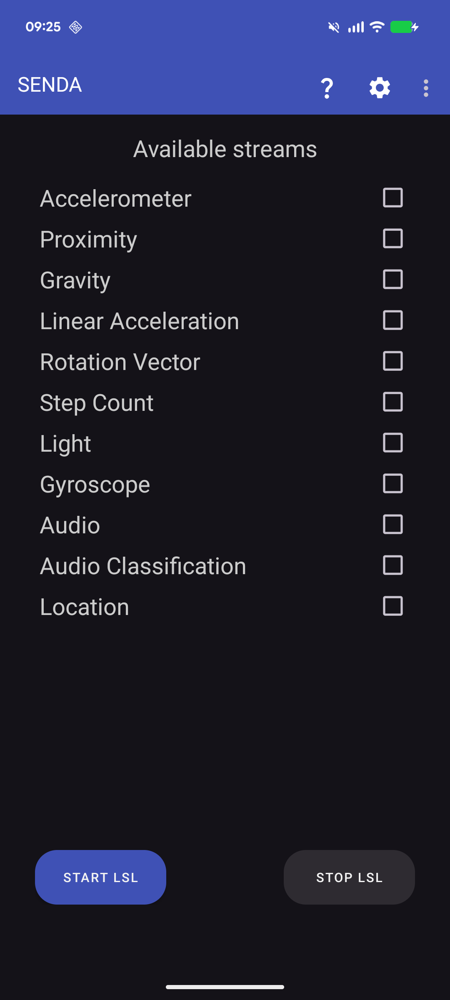
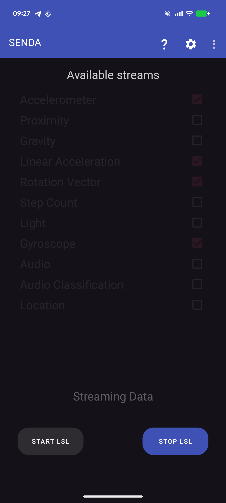

[](https://doi.org/10.5281/zenodo.1419527)
[](LICENSE)
[](https://github.com/NeuropsyOL/SENDA/releases/latest)

---

# SENDA — Sensor Data Streamer for Android

**SENDA** (Sensor Data Streamer) turns any Android smartphone or tablet into a real-time [Lab Streaming Layer (LSL)](https://labstreaminglayer.org) [[1]](#lsl-ref) data source. Motion, audio, location, and Bluetooth IMU data stream out of the phone and into any LSL-compatible setup — no proprietary hardware, no special network configuration.

> Developed by the [Neuropsychology lab](https://uol.de/neuropsy) of Stefan Debener at the University of Oldenburg.

---

## Citation

> **If you use SENDA in your research, please cite the following publication:**
>
> Haupt et al. — *Title TBA upon publication* — accepted. Citation will be updated once a DOI is available.

SENDA is provided **without any warranty**, and without guarantee of fitness for a particular purpose. Use it at your own risk. See [LICENSE](LICENSE) for the full terms.

---

## Why SENDA?

### A drop-in node for any LSL setup
Once SENDA is running, the smartphone appears as a regular LSL source on the local network, alongside EEG amplifiers, eye trackers, motion capture systems, or any other LSL device. There is nothing to install or configure on the recording side — if your setup already uses LSL, SENDA just works.

### Record with any LSL-compatible application
LSL streams from SENDA can be recorded, visualised, or processed by any LSL-compatible software, including:

- **[LabRecorder](https://github.com/labstreaminglayer/App-LabRecorder)** — the standard multi-stream recording tool for Windows, macOS, and Linux
- **[RECORDA](https://github.com/NeuropsyOL/RECORDA)** — a companion Android app for fully on-phone, cable-free recording
- Any custom application using the LSL API

### liblsl compiled natively for Android
SENDA **builds liblsl (v1.16.2) from source as part of its own Gradle/NDK build**, bundling the native library directly inside the APK. This approach — compiling the full C++ liblsl with CMake and the Android NDK — has not been widely achieved in other public Android projects. The result is a self-contained app with no runtime dependencies and no internet connection needed.

### Enabling mobile and ambulatory neuroscience
Smartphones are ubiquitous, affordable, and carry a rich set of onboard sensors. By bridging Android hardware to LSL, SENDA lowers the barrier for naturalistic and ambulatory research paradigms involving mobile EEG and other biosignal modalities.

---

## Screenshots

<p>
  
  &nbsp;&nbsp;&nbsp;
  
</p>

---

## Features

### Onboard sensors
The sensors available depend on the hardware of your device. Modern smartphones typically include all or most of the following, all of which SENDA can stream:
- Accelerometer
- Gyroscope
- Light
- Proximity
- Gravity
- Linear Acceleration
- Rotation Vector
- Step Count
- Location (GPS)

### External sensors
- **Movella DOT** IMU (via Bluetooth)

### Additional capabilities
- **Audio classification** powered by [YAMNet](https://www.tensorflow.org/hub/tutorials/yamnet) via [Google MediaPipe](https://developers.google.com/mediapipe) — runs fully on-device, no internet required
- **Audio recording** stream
- Dark theme (follows system setting)

---

## Data Formats

### Location
The location stream contains four channels (in order):
1. Latitude
2. Longitude
3. Elevation
4. Delta (metres since last fix)

### Movella DOT sensors
All Movella DOT sensors are set to `EULER_COMPLETE` mode at a nominal sampling rate of 60 Hz. Each stream has 7 channels:
1–3. Free acceleration (x, y, z)
4–6. Euler angles (roll, pitch, yaw)
7. Sensor sample time fine

See the Movella user manual for axis orientation and coordinate frame details.

---

## Getting Started

### Installation
Download the [latest release APK](https://github.com/NeuropsyOL/SENDA/releases/latest) and install it on any Android 11+ smartphone or tablet.

### Usage
1. Launch SENDA — the main screen lists all available sensors on your device.
2. Select the sensors you want to stream using the checkboxes. Swipe down to refresh the list.
3. Press **START LSL** to begin streaming. The app runs as a foreground service and keeps streaming while in the background.
4. On any machine connected to the same network, open LabRecorder (or any LSL-compatible app) to discover the streams and start recording.
5. Press **STOP LSL** to end the session.

> **Note:** SENDA and the recording machine must be on the same local network (Wi-Fi). For fully mobile setups, RECORDA can record all streams directly on the phone itself.

**Permissions:** Audio, GPS, and Movella sensors require explicit permission grants. A dialog is shown automatically when a sensor requiring permissions is selected. If a permission is repeatedly denied, the app will open the system settings so you can grant it manually.

**Battery optimisation:** On newer Android versions, disable battery optimisation for SENDA to prevent the OS from throttling the app during long recordings (**Settings → Battery → Battery optimization → SENDA → Don't optimize**).

---


## Development

### Prerequisites

| Tool | Version |
|------|---------|
| Android Studio | Meerkat 2024.3.1 or newer |
| Android SDK platform | API 35 |
| Android NDK | r28 (28.0.12433566) |
| CMake | 3.22.1 |

Other versions may work; the above are the versions used for development and testing.

### Building from source
1. Clone the repository including submodules:
   ```bash
   git clone --recurse-submodules https://github.com/NeuropsyOL/SENDA.git
   ```
2. Open the project in Android Studio and let Gradle sync.
3. Build and run on a device or emulator.

The native liblsl library is compiled automatically as part of the Gradle build via the Android NDK and CMake. No separate library installation is needed.

---

## Contributing
Contributions are welcome! Please open an issue first to discuss the proposed change, then submit a pull request.

## Authors
* **Sarah Blum** — [s4rify](https://github.com/s4rify)
* **Ali Ayub Khan** — [AliAyub007](https://github.com/AliAyub007)
* **Paul Maanen** — [pmaanen](https://github.com/pmaanen)

## License
GNU General Public License — see [LICENSE](LICENSE) for details.

---

## Known Issues
- Sometimes the app reports missing Bluetooth permissions but performs the Movella sensor scan anyway.
- After a fresh installation, multiple restarts may be required before the app detects newly granted permissions.
- Some devices may not properly honour foreground service or wakelock settings. A potential workaround is to allow unlimited background power usage for the app in the system settings.
- The bundled Movella SDK library is not yet compatible with Android's 16 KB ELF page-size requirement. Affected `.so` files are compressed in the APK as a workaround until the Movella SDK ships updated binaries.

## Acknowledgements
- [liblsl](https://github.com/sccn/liblsl) — MIT License
- [liblsl-Java](https://github.com/labstreaminglayer/liblsl-Java) — MIT License
- [Google MediaPipe](https://developers.google.com/mediapipe) — Apache 2.0 License
- Original SENDA by [Ali Ayub Khan](https://github.com/AliAyub007/SENDA)

---

## Research & Publications

### Primary reference
SENDA was initially designed, developed, and validated in the Debener lab. The following paper describes the initial version, validation experiments, and timing tests:

- **Blum S, Hölle D, Bleichner MG, Debener S.** Pocketable Labs for Everyone: Synchronized Multi-Sensor Data Streaming and Recording on Smartphones with the Lab Streaming Layer. *Sensors.* 2021; 21(23):8135. https://doi.org/10.3390/s21238135

### Current reference (required citation)
The current version of SENDA is described in:

- Haupt et al. — *Title TBA upon publication* — accepted. Citation will be updated once a DOI is available.

### Related work illustrating use cases
The following papers from the Debener lab illustrate the broader research context:

- **Debener S, Minow F, Emkes R, Gandras K, de Vos M.** How about taking a low-cost, small, and wireless EEG for a walk? *Psychophysiology.* 2012;49(11):1617–21. https://doi.org/10.1111/j.1469-8986.2012.01471.x
- **Bleichner MG, Debener S.** Concealed, Unobtrusive Ear-Centered EEG Acquisition: cEEGrids for Transparent EEG. *Front Hum Neurosci.* 2017;11:163. https://doi.org/10.3389/fnhum.2017.00163

### Lab Streaming Layer
<a name="lsl-ref"></a>
- **Kothe C, Shirazi SY, Stenner T, Medine D, Boulay C, Grivich MI, Artoni F, Mullen T, Delorme A, Makeig S.** The Lab Streaming Layer for Synchronized Multimodal Recording. *Imaging Neurosci (Camb).* 2025;3:IMAG.a.136. doi: [10.1162/IMAG.a.136](https://doi.org/10.1162/IMAG.a.136). PMID: 38405712; PMCID: PMC10888901.

